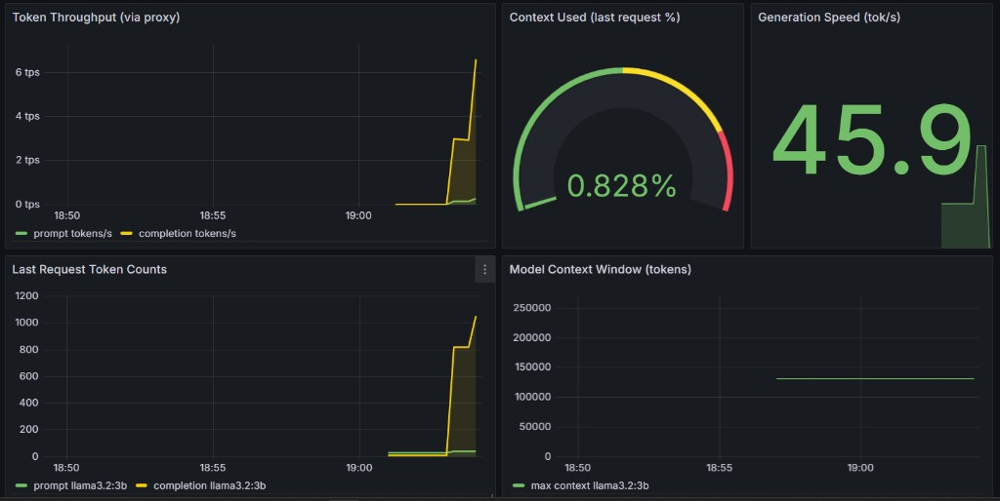

# k8s-ollama-observability

**LLM inference observability on k3s** — Ollama on Kubernetes with NVIDIA GPU metrics, custom token tracking, and Grafana dashboards. Built for **Windows 11 + WSL2** lab environments.

[](https://opensource.org/licenses/MIT)
[](https://k3s.io/)
[](https://prometheus.io/)
[](https://grafana.com/)
[](https://ollama.com/)
[](https://nvidia.com/)

> **Suggested GitHub topics:** `ollama` `prometheus` `grafana` `k3s` `nvidia` `observability` `llm` `kubernetes` `dcgm` `wsl2`

Collects and visualizes **NVIDIA GPU metrics**, **Ollama runtime metrics**, **per-request token usage**, and **Kubernetes cluster health** — all on a local k3s cluster.

---

## Architecture

```
┌──────────────────────────────────────────────────────────────────┐
│                    Windows 11 Host                               │
│  ┌─────────────────────────────────────────────────────────────┐ │
│  │                     WSL2 (Ubuntu)                           │ │
│  │  ┌───────────────────────────────────────────────────────┐  │ │
│  │  │                  k3s Kubernetes Cluster               │  │ │
│  │  │  monitoring namespace          llm namespace          │  │ │
│  │  │  ┌──────────┐ ┌──────────┐    ┌─────────┐ ┌─────────┐ │  │ │
│  │  │  │Prometheus│ │ Grafana  │    │ Ollama  │ │ ollama- │ │  │ │
│  │  │  │  :9090   │ │  :3000   │    │ :11434  │ │ exporter│ │  │ │
│  │  │  └──────────┘ └──────────┘    │ (GPU)   │ │ :9099   │ │  │ │
│  │  │  ┌──────────┐ ┌──────────┐    └────▲────┘ │ metrics │ │  │ │
│  │  │  │kube-state│ │node-     │         │      │ :11435  │ │  │ │
│  │  │  │-metrics  │ │exporter  │         └──────│ proxy   │ │  │ │
│  │  │  └──────────┘ └──────────┘   token path   └─────────┘ │  │ │
│  │  │  ┌──────────┐                                         │  │ │
│  │  │  │   DCGM   │                                         │  │ │
│  │  │  │ exporter │                                         │  │ │
│  │  │  │  :9400   │                                         │  │ │
│  │  │  └──────────┘                                         │  │ │
│  │  └───────────────────────────────────────────────────────┘  │ │
│  └─────────────────────────────────────────────────────────────┘ │
└──────────────────────────────────────────────────────────────────┘
```

### Metrics flow

| Source | Exporter | Key metrics | Scrape / path |
|--------|----------|-------------|----------------|
| NVIDIA GPU | `dcgm-exporter` | Utilization, VRAM, power, temp | `dcgm-exporter.monitoring:9400` |
| Ollama (poll) | `ollama-exporter` | Models loaded, VRAM/RAM, context limit | `:9099/metrics` |
| Ollama (proxy) | `ollama-exporter` | Prompt/completion tokens, tok/s, context % | Traffic via `:11435` |
| Kubernetes | `kube-state-metrics` | Pod phases, workloads | `:8080` |
| Node | `node-exporter` | CPU, memory, disk | `:9100` |

---

## Prerequisites

| Tool | Note |
|------|------|
| **Windows 11** | Latest updates |
| **WSL2** | Ubuntu distribution |
| **NVIDIA Driver** | On Windows host |
| **NVIDIA Container Toolkit** | In WSL2 |

Follow the [Windows WSL2 GPU Setup Guide](docs/windows-wsl2-gpu-setup.md) before deploying.

---

## Quick start (WSL2)

```bash
git clone https://github.com/<your-username>/k8s-ollama-observability.git
cd k8s-ollama-observability

make setup          # k3s + NVIDIA runtime
make deploy         # build exporter, apply manifests
make grafana-dashboards   # load dashboard JSON into Grafana
make pull-model     # download llama3.2:3b into PVC-backed Ollama
make port-forward   # Grafana :3000, Prometheus :9090
```

### Access

| Service | URL | Credentials |
|---------|-----|-------------|
| **Grafana** | http://localhost:3000 | `admin` / `observability` |
| **Prometheus** | http://localhost:9090 | — |
| **Ollama (direct)** | port-forward `svc/ollama` `:11434` | pull / admin |
| **Ollama (instrumented)** | port-forward `svc/ollama-exporter` `:11435` | token metrics |

---

## Token metrics

Ollama returns token counts in each API response (`prompt_eval_count` = input, `eval_count` = model output). The stack records them only when requests go through the **exporter proxy**, not direct `:11434` or `kubectl exec ollama run`.

| Port | Purpose |
|------|---------|
| **11434** | Ollama API (pull models, exec, direct inference — no token metrics in Prometheus) |
| **11435** | Proxy to Ollama — same API, records tokens for Grafana |
| **9099** | Prometheus `/metrics` scrape endpoint |

### Example (port-forward proxy, then generate)

```bash
kubectl port-forward -n llm svc/ollama-exporter 11435:11435 9099:9099
```

```bash
curl -s http://localhost:11435/api/generate -d '{
  "model": "llama3.2:3b",
  "prompt": "Write a short paragraph about Kubernetes.",
  "stream": false
}' | jq '{prompt_eval_count, eval_count}'
```

Wait ~15–30s for Prometheus to scrape, then open Grafana → **LLM Inference — Ollama**.



### Grafana dashboards (ConfigMap)

Dashboard JSON lives in `grafana/dashboards/`. After editing dashboards or on first install:

```bash
make grafana-dashboards
```

Or manually:

```bash
kubectl create configmap grafana-dashboards -n monitoring \
  --from-file=grafana/dashboards/llm-inference.json \
  --from-file=grafana/dashboards/overview.json \
  --from-file=grafana/dashboards/nvidia-gpu.json \
  --from-file=grafana/dashboards/k8s-cluster.json \
  --dry-run=client -o yaml | kubectl apply -f -
kubectl rollout restart deployment/grafana -n monitoring
```

---

## Dashboards

| Dashboard | What it shows |
|-----------|----------------|
| **Overview** | GPU util, Ollama up, loaded models, running pods, power |
| **NVIDIA GPU — DCGM** | Hardware VRAM, temperature |
| **LLM Inference — Ollama** | VRAM by model, token throughput, context %, tok/s, context window |
| **Kubernetes Cluster Health** | Node CPU and memory |

---

## Project structure

```
k8s-ollama-observability/
├── README.md
├── Makefile
├── docs/
│   ├── windows-wsl2-gpu-setup.md
│   └── images/
│       └── grafana-llm-inference.png
├── scripts/
│   ├── setup-k3s.sh
│   ├── deploy-stack.sh
│   ├── sync-grafana-dashboards.sh
│   ├── teardown.sh
│   └── validate.sh
├── exporters/ollama-exporter/    # Poll + proxy Prometheus exporter
├── kubernetes/                   # k3s manifests
└── grafana/dashboards/           # Dashboard JSON
```

---

## Components

### Ollama

Deployment in `llm` namespace with GPU via `runtimeClassName: nvidia`, models on a `local-path` PVC (`/root/.ollama`). Default lab model: `llama3.2:3b` (~2GB — fits 6GB GPUs with headroom).

### Custom ollama-exporter

Python exporter that:

- **Polls** Ollama (`/api/tags`, `/api/ps`, `/api/show`) → VRAM, loaded models, context window size
- **Proxies** `/api/generate` and `/api/chat` on `:11435` → Prometheus counters/gauges for tokens and latency

### NVIDIA DCGM exporter

DaemonSet for GPU telemetry (requires NVIDIA Container Toolkit + `RuntimeClass` `nvidia`).

---

## Makefile targets

```bash
make help                 # List targets
make setup                # Install k3s
make deploy               # Build exporter image + deploy stack
make grafana-dashboards   # Sync dashboard JSON to Grafana ConfigMap
make pull-model           # ollama pull llama3.2:3b (direct pod)
make test-inference       # Quick test via kubectl exec
make test-token-metrics   # Generate via proxy (for Grafana tokens)
make port-forward         # Grafana + Prometheus
make validate             # Health checks
make teardown             # Remove stack
```

---

## Contributing

Pull requests welcome.

---

## License

MIT — see [LICENSE](LICENSE).
